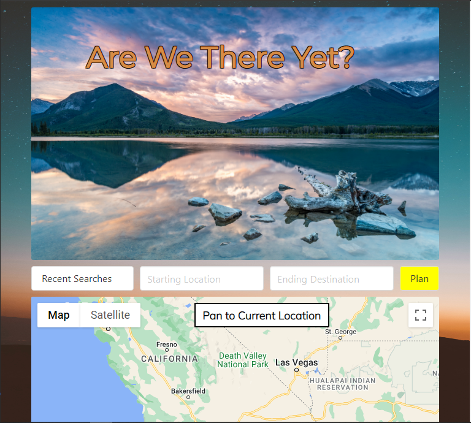
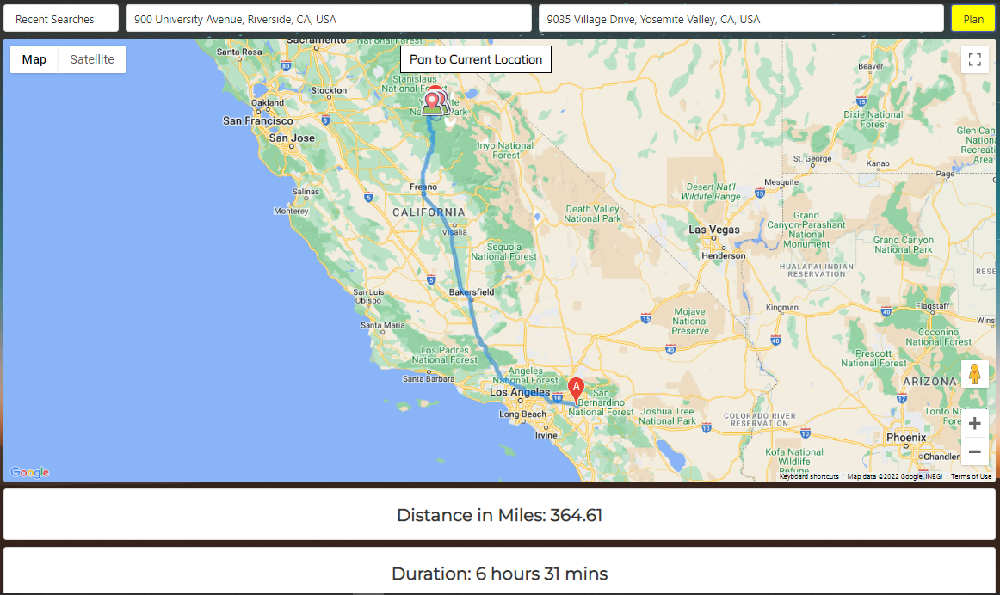
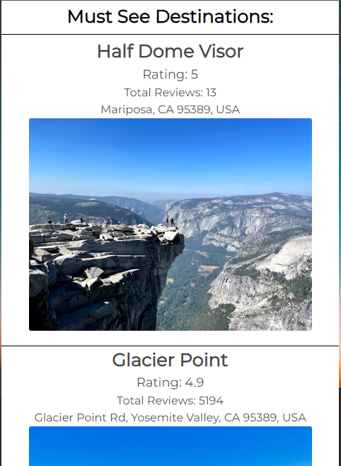

# Are We There Yet?
  
Welcome to our [“Are We There Yet?” App](https://dcontrer83.github.io/Roadtrip/)! 

## What does this app do?
"Are We There Yet?" aids users by reducing the friction associated with planning a road trip!  

  

Given two adresses, a starting location and an end destination, the app will present the user with:  
- the most optimal route to take to the end destination
- logistics information 
- markers indicating notible tourist attractions at the end destination
- a list of highly rated tourist attractions within the area
 

Here is what the user may see when go to the Must See Destinations section of the app:  
  

## Technologies Used:
Front End      | Back End
-------------  | -------------
HTML           | Node.js
CSS            | Express
Bulma          | Heroku
Javascript     | 
Google Maps API| 

## Developers:
Daniel Kang  

Diana Contreras  

Felix Cagatin  